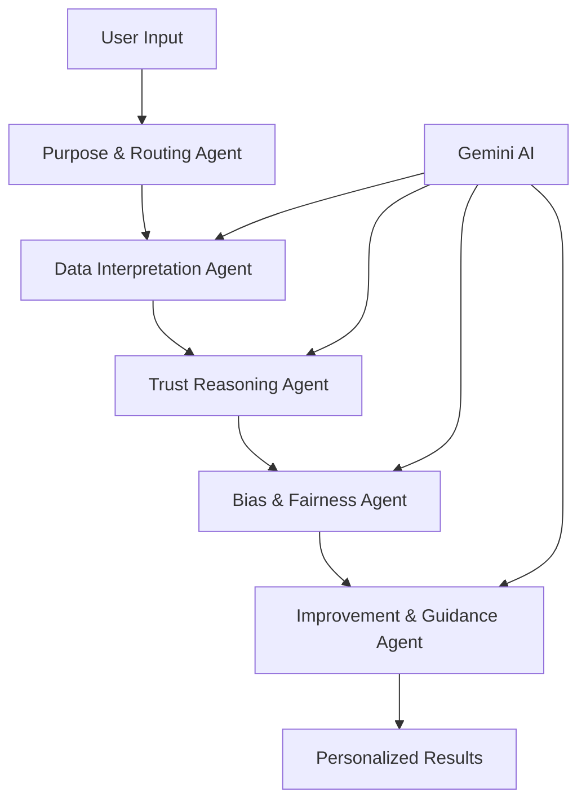

# 🌟 TrustWeave - AI-Powered Financial Trust Assessment System

**Team Name: Three Point Zero**

> **Revolutionizing financial inclusion through behavioral trust analysis and AI-driven credit assessment**

[](https://github.com/20Aarya05/three-point-zero-trustweave)
[](https://ai.google.dev/)
[](https://www.typescriptlang.org/)
[](https://reactjs.org/)
[](https://nodejs.org/)

## 🚀 What is TrustWeave?

TrustWeave is a cutting-edge **AI-powered financial trust assessment platform** that evaluates creditworthiness through behavioral patterns rather than traditional credit scores. Perfect for underbanked populations and emerging markets, it uses **Google Gemini AI** to analyze:

- 📱 **Mobile Usage Patterns** - SIM duration, recharge regularity, usage consistency
- ⚡ **Utility Payment Behavior** - On-time payments, delay patterns, bill predictability  
- 🤝 **Community Engagement** - Group participation, shared responsibility, dispute history
- 📄 **Evidence Documentation** - Bills, receipts, payment proofs with AI analysis
- 💼 **Financial Capacity** - Employment, income stability, asset information

## ✨ Key Features

### 🧠 **AI-Powered Analysis**
- **5 Specialized AI Agents** working in harmony
- **Google Gemini Integration** for intelligent reasoning
- **Behavioral Pattern Recognition** across multiple domains
- **Bias Detection & Fairness** built-in protection

### 🎯 **Trust Band System**
- **T5 - Exceptional Trust** (750-850 equivalent)
- **T4 - Strong Trust** (700-749 equivalent)
- **T3 - Developing Trust** (650-699 equivalent)
- **T2 - Emerging Trust** (600-649 equivalent)
- **T1 - Limited Trust** (550-599 equivalent)

### 💡 **Personalized Recommendations**
- **Specific improvement actions** with timelines
- **Next-level roadmap** for trust band advancement
- **Encouraging guidance** and progress tracking
- **Cultural context awareness** for fair assessment

### 🛡️ **Enterprise-Grade Security**
- **No database dependencies** - runs standalone
- **Environment variable protection** 
- **Rate limiting** and security headers
- **Graceful error handling** with fallbacks

## 🏗️ Architecture Overview



### 🤖 **5 AI Agents System**

1. **Purpose & Routing Agent** - Determines assessment strategy based on loan purpose
2. **Data Interpretation Agent** - AI-powered behavioral pattern analysis
3. **Trust Reasoning Agent** - Intelligent trust band assignment with context
4. **Bias & Fairness Agent** - Ensures fair treatment and bias correction
5. **Improvement & Guidance Agent** - Generates personalized recommendations

## 🚀 Quick Start

### Prerequisites
- **Node.js** 18+ 
- **npm** or **yarn**
- **Google Gemini API Key** ([Get it here](https://ai.google.dev/))

### 1. Clone & Install
```bash
git clone https://github.com/20Aarya05/three-point-zero-trustweave.git
cd three-point-zero-trustweave
npm install
```

### 2. Environment Setup
```bash
# Copy environment template
cp .env.example .env

# Add your Gemini API key
echo "GEMINI_API_KEY=your_actual_gemini_api_key_here" >> .env
```

### 3. Start Backend
```bash
npm run dev
```
✅ Server runs on `http://localhost:3001`

### 4. Start Frontend
```bash
cd frontend
npm install
npm run dev
```
✅ Frontend runs on `http://localhost:5173`

## 📖 API Documentation

### 🎯 **Trust Assessment Endpoint**
```http
POST /api/trust/assess
Content-Type: application/json
```

**Request Body:**
```json
{
  "purpose": "medium",
  "mobile": {
    "simDuration": "more_than_2_years",
    "rechargeRegularity": "very_regular",
    "usageConsistency": "very_stable"
  },
  "utility": {
    "onTimePayment": "always",
    "delayFrequency": "never",
    "billPredictability": "very_consistent"
  },
  "community": {
    "groupParticipation": "very_active",
    "sharedResponsibility": "high",
    "disputeHistory": "clear"
  },
  "evidence": [],
  "loanExperience": "never",
  "financial": {
    "employmentType": "government",
    "incomeRange": "30k-50k",
    "incomeStability": "very_stable"
  },
  "assets": {
    "property": false,
    "fixedDeposits": true,
    "collateralWillingness": true
  }
}
```

**Response:**
```json
{
  "trustBand": "T4 - Strong Trust",
  "interpretation": "Outstanding financial reliability! You demonstrate exceptional consistency across all behavioral areas.",
  "traditionalAlignment": "700-749",
  "reasoning": [
    "Outstanding 2+ year mobile relationship with very regular recharge patterns",
    "Perfect utility payment record with no delays demonstrates financial discipline",
    "Very active community participation shows strong social responsibility"
  ],
  "metadata": {
    "assessment_type": "ai-powered-trust",
    "generated_at": "2024-01-15T10:30:00Z",
    "version": "v2-ai"
  }
}
```

### 🏥 **Health Check**
```http
GET /health
```

**Response:**
```json
{
  "status": "healthy",
  "services": {
    "api": "healthy",
    "ai": "ready"
  },
  "timestamp": "2024-01-15T10:30:00Z",
  "uptime": 3600
}
```

## 🎨 Frontend Features

### 📱 **Modern React Interface**
- **5-Step Assessment Flow** with intuitive UI
- **Real-time AI Processing** with progress indicators
- **Detailed Results Display** with trust band visualization
- **Improvement Recommendations** with actionable steps
- **Responsive Design** for mobile and desktop

### 🎯 **User Journey**
1. **Purpose Selection** - Choose loan type and amount
2. **Behavioral Input** - Mobile, utility, community patterns
3. **Evidence Upload** - Bills, receipts, payment proofs
4. **Financial Details** - Employment and income information
5. **AI Analysis** - Real-time processing with 5 AI agents
6. **Results & Guidance** - Trust band with improvement roadmap

## 🔧 Configuration

### Environment Variables
```bash
# Required
GEMINI_API_KEY=your_gemini_api_key_here

# Optional
PORT=3001
NODE_ENV=development
CORS_ORIGIN=http://localhost:3000
```

### Frontend Configuration
```bash
# frontend/.env.local
VITE_GEMINI_API_KEY=your_gemini_api_key_here
```

## 🧪 Testing

### Backend API Testing
```bash
# Test trust assessment
curl -X POST http://localhost:3001/api/trust/assess \
  -H "Content-Type: application/json" \
  -d @examples/request-payload.json

# Health check
curl http://localhost:3001/health
```

### Frontend Testing
```bash
cd frontend
npm run build
npm run preview
```

## 📊 Sample Results

### 🌟 **T4 - Strong Trust Example**
```
Trust Band: T4 - Strong Trust
Traditional Alignment: 700-749
Confidence: High

Key Strengths:
✅ 2+ year mobile relationship with consistent patterns
✅ Perfect utility payment record (always on-time)
✅ Very active community participation
✅ Government employment with stable income

Improvement Actions:
📈 Upload 3 more months of evidence → Potential T5 upgrade
📋 Add employment certificate → Boost confidence score
⏰ Timeline: 2-3 months for T5 Exceptional Trust
```

### 🚀 **T3 - Developing Trust Example**
```
Trust Band: T3 - Developing Trust  
Traditional Alignment: 650-699
Confidence: Moderate

Key Strengths:
✅ Good mobile usage consistency
✅ Generally reliable utility payments
✅ Active community member

Improvement Actions:
📱 Maintain current payment patterns → Strengthen reliability
📄 Upload 6 months of comprehensive evidence → Boost to T4
💼 Provide income stability documentation → Increase confidence
⏰ Timeline: 3-4 months for T4 Strong Trust
```

## 🛠️ Development

### Project Structure
```
trustweave/
├── src/                    # Backend source
│   ├── services/          # AI agents & core services
│   ├── routes/            # API endpoints
│   ├── middleware/        # Security & validation
│   └── types/             # TypeScript definitions
├── frontend/              # React frontend
│   ├── components/        # UI components
│   ├── services/          # API clients
│   └── types.ts           # Frontend types
├── database/              # SQL schemas (optional)
├── postman-samples/       # API testing samples
└── examples/              # Request/response examples
```

### Key Technologies
- **Backend**: Node.js, Express, TypeScript
- **Frontend**: React, TypeScript, Vite
- **AI**: Google Gemini 2.0 Flash
- **Security**: Helmet, CORS, Rate Limiting
- **Validation**: Zod schema validation

## 🌍 Use Cases

### 🏦 **Financial Institutions**
- **Alternative credit scoring** for underbanked populations
- **Loan approval automation** with AI-powered insights
- **Risk assessment** based on behavioral patterns
- **Financial inclusion** for emerging markets

### 🏢 **Fintech Companies**
- **Digital lending platforms** with behavioral analysis
- **Microfinance** for small business owners
- **P2P lending** with trust-based matching
- **Credit building** programs with guidance

### 🌐 **Government & NGOs**
- **Financial inclusion initiatives** 
- **Rural banking** programs
- **Policy development** based on behavioral insights

## 🤝 Contributing

We welcome contributions! Please see our [Contributing Guidelines](CONTRIBUTING.md) for details.

### Development Setup
```bash
# Clone repository
git clone https://github.com/20Aarya05/three-point-zero-trustweave.git

# Install dependencies
npm install
cd frontend && npm install

# Start development servers
npm run dev          # Backend on :3001
cd frontend && npm run dev  # Frontend on :5173
```
